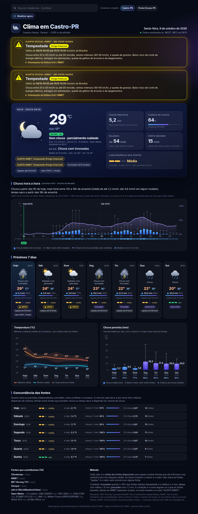

# Clima em Castro-PR

Painel com a previsão do tempo para os próximos 7 dias em Castro e Ponta Grossa (Paraná), feito a partir do **consenso de várias fontes de previsão** (Open-Meteo/vários modelos, MET Norway, wttr.in, INMET, Climatempo e Simepar quando disponível), incluindo os avisos meteorológicos do INMET para cada município. Uma barra de busca permite consultar qualquer outra cidade ao vivo (consenso de vários modelos do Open-Meteo, calculado no navegador).

🔗 **Acesse:** https://conradomaxcruz.github.io/clima-castro/

## Como funciona
- A página (`index.html`) é autocontida (sem bibliotecas externas): Castro e Ponta Grossa funcionam offline; só a busca de outras cidades consulta a API pública do Open-Meteo.
- Para cada dia, as fontes disponíveis são comparadas e é calculada a média de temperatura, chuva e vento, com um indicador de **concordância** entre as previsões (alta, média ou baixa).
- O painel é atualizado automaticamente várias vezes por dia.
- Links diretos: `?cidade=ponta-grossa`, `?cidade=Curitiba`.

*Previsões são estimativas e podem mudar. Em caso de alerta, siga as orientações da Defesa Civil.*
